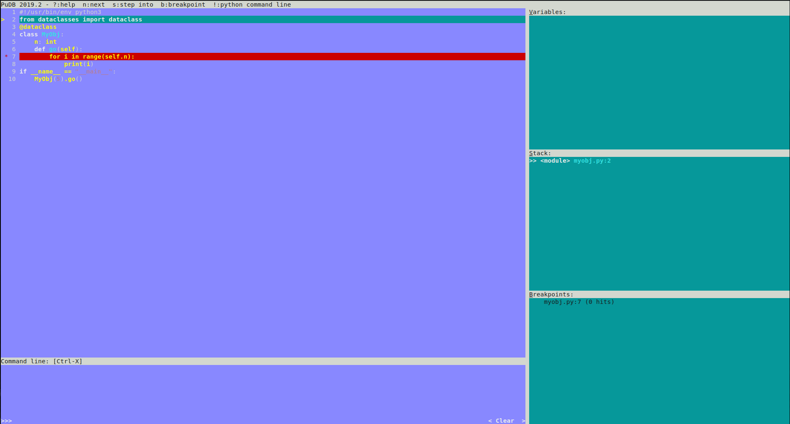

# Кен Томпсон


##
<span class="underline"><span class="underline">[Wiki](https://ru.wikipedia.org/wiki/%25D0%25A2%25D0%25BE%25D0%25BC%25D0%25BF%25D1%2581%25D0%25BE%25D0%25BD,_%25D0%259A%25D0%25B5%25D0%25BD)</span></span>


## Томпсон


# print

> Сейбел: Какие инструменты вы используете при отладке?
>
> Томпсон: В основном вывод на печать. При разработке программы я размещаю очень много операторов вывода на печать.


# Чуть лучше чем принт

<span class="underline"><span class="underline">[logging](https://docs.python.org/3/library/logging.html)</span></span>

-   Во время разработки можно выводить сообщения на экран
-   В продакшене, пишем сообщения уже в логгер (syslog, просто в файл)
-   Можем настраивать режими отладки


# PDB


## myobj.py     :B_block:

```python
from dataclasses import dataclass
@dataclass
class MyObj:
    n: int
    def go(self):
        for i in range(self.n):
            print(i)
if __name__ == "__main__":
    MyObj(5).go()
```


##

```shell
python -m pdb ./myobj.py
```


# PDB

Можно вызвать в рамках Python-сессии

```python
import pdb
from myobj import MyObj

pdb.run("MyObj(5).go()")
```


# PDB

Чаще всего может потребоваться перейти в режим отладки в определённом месте программы

```python
# тут какой-то код
def main(request):
    import pdb # ipdb
    pdb.set_trace() # ipdb.set_trace()
    data = request.GET
# дальше много кода
```


# PDB

```python
try:
    some_code()
except:
    import sys
    import ipdb
    tb = sys.exc_info()[2]
    ipdb.post_mortem(tb)
```


# PDB

-   **h(elp) [command]:** выведет подсказку по доступным командам
-   **a(rgs):** напечать аргументы текущей функции (текущего стека вызовов)
-   **p <expression>:** напечатать содержимое переменной или результат вызова
-   **pp <expression>:** красиво напечатать
-   **w(here):** покажет стектрейс как вы очутились в текущем месте кода
-   **l(ist) [start [end]]:** выведет по 5 строк вокруг текущей или вокруг заданной, либо выведет строки со start по end
-   **u(p) / d(own):** перемещение по стеку вызовов


# PDB

-   **! выражение:** выполнить выражение, например переопределить значение переменной
-   **s(tep):** зайти внутрь вызова
-   **n(ext):** следующая строка кода
-   **b(reak) [ ([filename:]lineno | function) [, condition] ]:** добавить точку останова
-   **tbreak [([filename:]lineno | function) [, condition]]:** одноразовая точка останова
-   **condition bpnumber [condition]:** добавить условие для точки останова
-   **disable / enable tbnumber:** выкл / вкл точку останова
-   **cl(ear) (filename:lineno | bpnumber):** удалить точку останова


# Дополнительное чтение

-   <span class="underline"><span class="underline">[import pdb](https://docs.python.org/3/library/pdb.html)</span></span>
-   <span class="underline"><span class="underline">[pdb — интерактивный отладчик](https://habr.com/ru/post/104086/?ysclid=l1dacrrmk3)</span></span>
-   <span class="underline"><span class="underline">[python debugging with pdb](https://realpython.com/python-debugging-pdb/)</span></span>


# PuDB

```shell
python -m pudb myobj.py
```




# Visual Studio Code / PyCharm

-   <span class="underline"><span class="underline">[VSC](https://docs.microsoft.com/ru-ru/visualstudio/python/debugging-python-in-visual-studio?view=vs-2022)</span></span>
-   <span class="underline"><span class="underline">[PyCharm](https://www.jetbrains.com/ru-ru/pycharm/features/debugger.html)</span></span>


# runserver\_plus

<span class="underline"><span class="underline">[installation instruction](https://django-extensions.readthedocs.io/en/latest/installation_instructions.html)</span></span>

```shell
WERKZEUG_DEBUG_PIN=1234 \
    python manage.py runserver_plus
```
